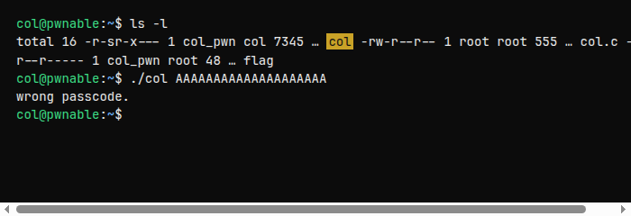
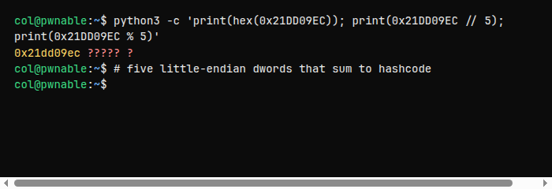
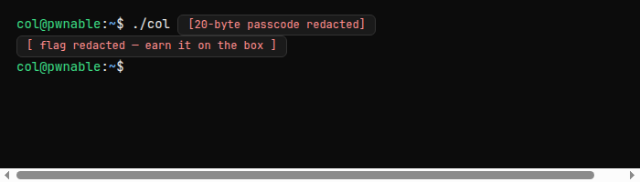

<div class="challenge-hero" markdown="0">
  
  <div class="challenge-hero-copy">
    <p class="challenge-eyebrow">Toddler's Bottle · Level 2</p>
    <p class="challenge-prompt">Daddy told me about cool MD5 hash collision today. I wanna do something like that too!</p>
    
  </div>
</div>

After [fd](post.html?slug=pwnable-kr-fd), Toddler's Bottle hands you **collision** — a tiny C program that *sounds* like cryptography and is really just integer packing plus addition.

<aside class="callout callout-info">
<strong>Approach</strong>
Supply a 20-byte <code>argv[1]</code>. The binary reinterprets those bytes as five 32-bit ints, sums them, and compares the total to a fixed “hashcode.” Build five little-endian dwords that add up to that constant. Flag stays on the box.
</aside>

## Challenge card

| | |
| --- | --- |
| **Site** | [pwnable.kr](https://pwnable.kr) |
| **Category** | Toddler's Bottle |
| **Hint** | *Daddy told me about cool MD5 hash collision today…* |
| **SSH** | `ssh col@pwnable.kr -p2222` |
| **Password** | `guest` |
| **Idea** | 20 bytes → 5×`int` sum == `hashcode` |

## Connecting

```bash
ssh col@pwnable.kr -p2222
# password: guest
```

Same pattern as `fd`: setgid binary, readable source, locked flag.



<aside class="callout callout-tip">
<strong>Tip</strong>
Work in <code>/tmp</code> if you like: <code>cp ~/col ~/col.c /tmp/&& cd /tmp</code>. Keep the passcode free of embedded NUL bytes — <code>argv</code> is a C string.
</aside>

## Source walkthrough

`col.c` (structure — open the real file on the box):

```c
unsigned long hashcode = 0x21DD09EC;

unsigned long check_password(const char* p){
    int* ip = (int*)p;
    int i;
    int res = 0;
    for (i = 0; i < 5; i++) {
        res += ip[i];
    }
    return res;
}

int main(int argc, char* argv[]){
    if (argc < 2) { /* usage */ return 0; }
    if (strlen(argv[1]) != 20) {
        printf("passcode length should be 20 bytes\n");
        return 0;
    }
    if (hashcode == check_password(argv[1])) {
        system("/bin/cat flag");
    } else {
        printf("wrong passcode.\n");
    }
}
```

What matters:

| Piece | Meaning |
| --- | --- |
| `strlen == 20` | Exactly twenty bytes — no more, no less. |
| `(int*)p` | Reinterpret those bytes as a little-endian `int` array. |
| Loop `i < 5` | Five ints × 4 bytes = 20 bytes. |
| `hashcode` | Target sum: `0x21DD09EC`. |

Twenty `'A'`s fail for the obvious reason — the sum is wrong:

```text
$ ./col AAAAAAAAAAAAAAAAAAAA
wrong passcode.
```

## The “hash”

There is no MD5. `check_password` is a toy checksum: **sum five machine integers**.

On x86 those ints are **little-endian**. If you want the numeric value `0xAABBCCDD` in memory, the bytes on the wire / in `argv` are `\xdd\xcc\xbb\xaa`.

<aside class="callout callout-info">
<strong>Mental model</strong>
Think of the passcode as five sealed envelopes of four bytes each. The program opens each envelope as an <code>int</code>, adds the numbers, and asks whether the total equals <code>hashcode</code>.
</aside>

## Building five ints

You need:

```text
ip[0] + ip[1] + ip[2] + ip[3] + ip[4]  ==  0x21DD09EC
```

Simplest construction: divide by five, put the remainder on the last chunk.

```text
q = hashcode // 5
r = hashcode % 5
→  [q, q, q, q, q+r]
```



<aside class="callout callout-tip">
<strong>Python sketch</strong>
<code>from pwn import *</code> then <code>p32(q)*4 + p32(q+r)</code> packs little-endian for you. Print to stdout and feed <code>./col "$(python3 solve.py)"</code> — or write the bytes to a file and pass them carefully if your shell mangles binary.
</aside>

Watch for:

- **NUL bytes** — a zero dword truncates `argv[1]` under `strlen`. Prefer solutions where every byte is non-zero (the classic quotient construction does).
- **Signed `int` overflow** — values stay comfortably positive here; don't overthink wrap unless you invent wild chunks.
- **Multiple solutions** — any five ints that sum correctly work. That is the “collision”: many preimages, one checksum.

<details class="spoiler">
<summary>Spoiler — shape of the solve (no byte string)</summary>

```python
from pwn import *
h = 0x21DD09EC
q, r = divmod(h, 5)
sys.stdout.buffer.write(p32(q) * 4 + p32(q + r))
```

```bash
./col "$(python3 solve.py)"
```

</details>



## Flag

<aside class="callout callout-warn">
<strong>Redacted</strong>
Not published here. When the checksum matches, <code>col</code> cats the flag for you — submit that string on the site.
</aside>

## What this teaches

- **Type punning** — `char*` → `int*` is how C lets you re-slice bytes.
- **Endianness** — packing integers for x86 means reversing byte order.
- **Checksum ≠ crypto** — a sum is trivial to invert; “hash collision” here is tongue-in-cheek.
- **argv constraints** — length checks and C strings ban NULs in the middle.

## Next bottle

Stack smash next: [bof](post.html?slug=pwnable-kr-bof) — overwrite a function argument through `gets`.

<div class="challenge-hero challenge-hero-footer" markdown="0">
  
  <div class="challenge-hero-copy">
    <p class="challenge-eyebrow">Official art · pwnable.kr</p>
    <p class="challenge-prompt">Checksum forged. Onto the stack.</p>
    
  </div>
</div>
