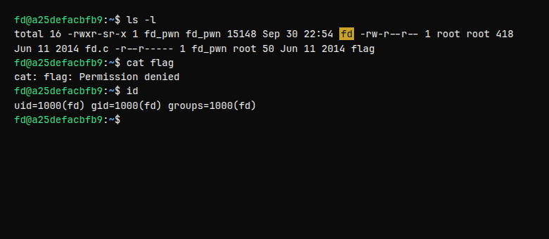
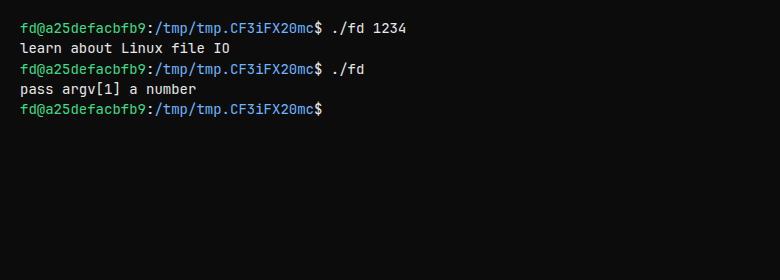
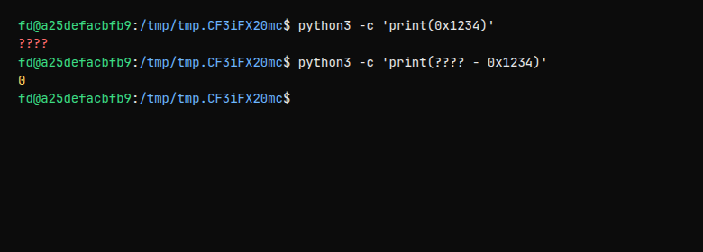

<div class="challenge-hero" markdown="0">
  
  <div class="challenge-hero-copy">
    <p class="challenge-eyebrow">Toddler's Bottle · Level 1</p>
    <p class="challenge-prompt">Mommy! what is a file descriptor in Linux?</p>
    
  </div>
</div>

[pwnable.kr](https://pwnable.kr) is a classic binary exploitation wargame. Challenges live on a real Linux box you SSH into, and the first category — **Toddler's Bottle** — teaches core OS ideas with tiny, readable C programs.

`fd` is the first bottle. There is no shellcode, no ROP, no heap gymnastics. The whole problem is: **do you know what a file descriptor is, and can you make `read()` listen to you?**

<aside class="callout callout-info">
<strong>TL;DR</strong>
Make <code>read()</code> use stdin (fd <code>0</code>) by choosing <code>argv[1]</code> so the <code>0x1234</code> subtraction cancels out, then feed the exact compare string from the source. The setgid binary will cat the flag for you — details below, spoilers folded.
</aside>

## Challenge card

| | |
| --- | --- |
| **Site** | [pwnable.kr](https://pwnable.kr) |
| **Category** | Toddler's Bottle |
| **Hint** | *Mommy! what is a file descriptor in Linux?* |
| **SSH** | `ssh fd@pwnable.kr -p2222` |
| **Password** | `guest` |
| **Idea** | Force `read()` onto fd `0`, feed the magic string |

## Connecting

```bash
ssh fd@pwnable.kr -p2222
# password: guest
```

You land in the `fd` user's home directory on their challenge host. Everything you need is already there: the binary, the source, and a flag you cannot read yet.

<aside class="callout callout-tip">
<strong>Tip</strong>
Copy the challenge into a temp directory before experimenting — keeps your home clean and matches how most writeups demo the box:
<code>mkdir /tmp/fdplay && cp ~/fd ~/fd.c /tmp/fdplay && cd /tmp/fdplay</code>
</aside>

## Reconnaissance

Start with permissions. This is where the challenge *tells* you the privilege model:

```text
$ ls -l
-rwxr-sr-x 1 fd_pwn fd_pwn 15148  fd
-rw-r--r-- 1 root   root     418  fd.c
-r--r----- 1 fd_pwn root      50  flag
```



Three facts jump out:

1. **`fd` is executable and setgid `fd_pwn`.** The `s` in the group-execute bit (`-rwxr-sr-x`) means: when you run it, the process's *effective group* becomes `fd_pwn`.
2. **`flag` is readable only by owner `fd_pwn` (and group `root`).** Your login user `fd` is neither, so a direct `cat` fails.
3. **`fd.c` is world-readable.** No reverse engineering required — they hand you the source.

Confirm the lock:

```text
$ cat flag
cat: flag: Permission denied
```

And zoom in on the binary:


<aside class="callout callout-warn">
<strong>Why setgid matters</strong>
Your real UID/GID stay <code>fd</code>, but the effective GID becomes <code>fd_pwn</code> while the binary runs. Later the program calls <code>setregid(getegid(), getegid())</code> before <code>system("/bin/cat flag")</code>, so the spawned shell inherits that privileged group and can open <code>flag</code>.
</aside>

## Source walkthrough

```bash
$ cat fd.c
```


Here is the program again, annotated:

```c
#include <stdio.h>
#include <stdlib.h>
#include <string.h>

char buf[32];

int main(int argc, char* argv[], char* envp[]){
    if (argc < 2) {
        printf("pass argv[1] a number\n");
        return 0;
    }

    /* Your number → file descriptor */
    int fd = atoi(argv[1]) - 0x1234;

    /* Read up to 32 bytes FROM that fd into buf */
    int len = 0;
    len = read(fd, buf, 32);

    /* Must match exactly, including the newline */
    if (!strcmp("LETMEWIN\n", buf)) {
        printf("good job :)\n");
        setregid(getegid(), getegid());
        system("/bin/cat flag");
        exit(0);
    }

    printf("learn about Linux file IO\n");
    return 0;
}
```

Walk it in order:

| Step | Code | Meaning |
| --- | --- | --- |
| 1 | `argc < 2` | You must pass a number as `argv[1]`. |
| 2 | `atoi(argv[1]) - 0x1234` | Convert that string to an int, subtract hex `0x1234`, treat the result as an fd. |
| 3 | `read(fd, buf, 32)` | Kernel reads ≤32 bytes from that fd into `buf`. |
| 4 | `!strcmp("LETMEWIN\n", buf)` | Buffer must equal that exact string (with `\n`). |
| 5 | `setregid` + `system("…/cat flag")` | Drop into a shell with the effective group, print the flag. |

If anything fails, you get the cheeky nudge: `learn about Linux file IO`.



## Linux file descriptors (the real lesson)

A **file descriptor** is just a small non-negative integer the kernel uses as a handle for an open file, socket, pipe, or terminal. Every process starts with three:

| fd | Name | Usual meaning |
| ---: | --- | --- |
| **0** | stdin | Keyboard / pipe input |
| **1** | stdout | Terminal output |
| **2** | stderr | Error output |

`read(2)` does not care whether the fd came from `open("file")` or was stdin from birth:

```c
ssize_t read(int fd, void *buf, size_t count);
```

So when this challenge computes an `fd` and hands it to `read`, **you choose which stream the program listens to.**

<aside class="callout callout-info">
<strong>Mental model</strong>
Think of fds as numbered doors. Door <code>0</code> already opens onto your terminal. If you can force the program to knock on door <code>0</code>, anything you type (or pipe) becomes the bytes in <code>buf</code>.
</aside>

We control that door number through:

```c
int fd = atoi(argv[1]) - 0x1234;
```

We want `fd == 0` (stdin). Solve for the argument:

```text
argv[1] - 0x1234  =  0
argv[1]           =  0x1234
argv[1]           =  ?????   (convert hex → decimal)
```



<aside class="callout callout-tip">
<strong>Quick hex check</strong>
Break it down by place values, or just <code>python3 -c 'print(0x1234)'</code>. Write the decimal down — that is your <code>argv[1]</code>.
</aside>

## Exploitation

You now have everything you need in the source:

1. Pick `argv[1]` so `atoi(argv[1]) - 0x1234 == 0` (stdin).
2. When `read(0, …)` waits, send the **exact** string the `strcmp` expects — including the newline.
3. Enjoy `good job :)` and a flag you could not `cat` yourself.

Work the arithmetic yourself (`python3 -c 'print(0x1234)'` helps). The compare target is sitting in plain sight inside `fd.c`.

<details class="spoiler">
<summary>Spoiler — exact commands</summary>

### Interactive

```bash
./fd <decimal form of 0x1234>
# then type the strcmp target and press Enter
```

### One-liner (pipe)

Piping is the same idea: the pipe *is* stdin (fd 0).

```bash
echo '<strcmp target without escaping the newline echo adds>' | ./fd <decimal form of 0x1234>
```

</details>


### Why the newline matters

The compare string in source ends with `\n`. Typing the word and hitting Enter (or using `echo`, which appends a newline by default) supplies that byte. Without it, `strcmp` fails and you are back to learning about Linux file IO.

## Flag

<aside class="callout callout-warn">
<strong>Redacted</strong>
No free lunch — run the binary yourself on the box and submit what it prints. The screenshot above has the flag line blurred on purpose.
</aside>
## What this teaches (keep these)

- **Fds are integers.** stdin/stdout/stderr are not magic — they are `0` / `1` / `2`.
- **`read(fd, …)` is the primitive.** Once you control `fd`, you control the data source.
- **Setgid (and setuid) are the privilege story.** The binary elevates so it can read a file you cannot.
- **Hex constants in challenges are invitations.** When you see `0x1234`, convert it and ask what value zeros the expression.
- **Exact string compares are picky.** Newlines, lengths, and nulls matter.

## Next bottle

With fds in your pocket, the Toddler's Bottle list opens up — `collision`, `bof`, `flag`, and friends each teach one sharp idea the same way. Same SSH style, same habit: **read the source, map the privilege bits, force the program into a state you control.**

<div class="challenge-hero challenge-hero-footer" markdown="0">
  
  <div class="challenge-hero-copy">
    <p class="challenge-eyebrow">Official art · pwnable.kr</p>
    <p class="challenge-prompt">Same pink porings. Next bottle when you're ready.</p>
    
  </div>
</div>
