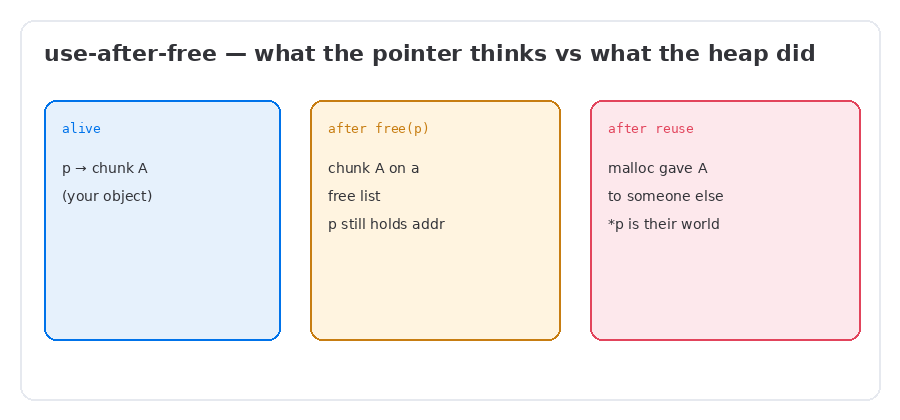
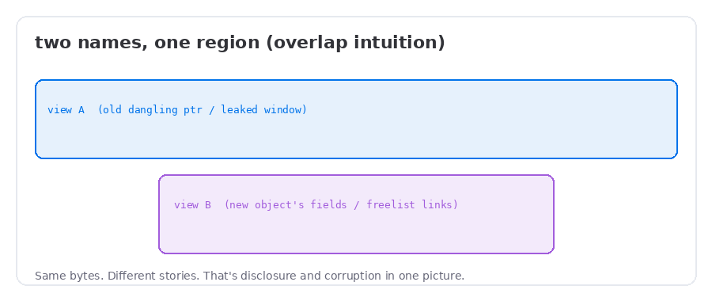
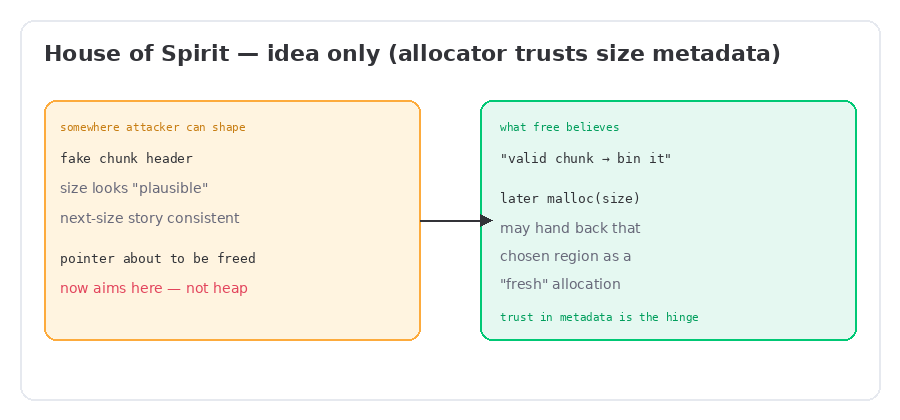

<aside class="callout callout-info">
<strong>Series</strong>
Part 2 of my heap notes. Continues from <a href="post.html?slug=where-the-break-lives">Where the Break Lives</a>. Still foundations-of-<em>bugs</em>, not a how-to. No exploit recipes here — just the mental models that made later reading make sense.
</aside>

Part 1 got me a map: stack up high, ELF down low, heap growing from the break, `malloc` carving chunks inside kernel mappings. The teaser at the end was basically: *metadata next to your buffer is trusted*.

What I could finally notice after that map:

- free doesn’t erase your pointer
- the next `malloc` might hand those same bytes to someone else
- if two stories share one region, you get leaks and corruption for free (the bad kind of free)

This page is what clicked for me on **use-after-free**, **overlapping / disclosing memory**, and the **House of Spirit** *idea* — the “free something that isn’t a real heap chunk” intuition. I’m stopping before bins-deep recipes. Those wait.

## Use-after-free: the pointer that didn’t get the memo

I used to hear “use after free” and picture a crash. Sometimes it is. The scarier version is quieter: the program keeps a pointer, calls `free`, and later **reads or writes through that pointer like the object still lives**.

```c
struct Note { char *text; size_t len; };

struct Note *n = malloc(sizeof *n);
n->text = malloc(64);
/* … fill n->text … */

free(n);          /* chunk goes back to the allocator */
/* n is still sitting in my register / local — dangling */

/* later, some other code path still does: */
puts(n->text);    /* “use” — but whose chunk is this now? */
```

That’s a **bug pattern**, not an exploit. What I had to internalize: after `free(n)`, the *address* in `n` is still a number. The heap’s story changed. Mine didn’t.



### What “use” actually means after free

When the allocator reuses that chunk for a later `malloc`, my dangling pointer isn’t looking at “freed emptiness.” It’s looking at:

- someone else’s object fields, or
- freelist bookkeeping the allocator wrote into the chunk, or
- whatever got written there next

So the phrase that stuck: **use-after-free is often “someone else’s chunk now.”** The bug is lifetime. The weirdness is *aliasing across ownership*.

<aside class="callout callout-warn">
<strong>What I watch for in code</strong>
A pointer that survives <code>free</code> without being nulled or proven unreachable. Especially when that pointer is stored in a global, a queue, another heap object, or a callback — places lifetime is easy to lose track of.
</aside>

Defensive intuition (the part I actually want in my own C): free and forget on purpose — clear the pointer, don’t leave dual owners, prefer patterns where one module owns the lifetime. Allocators and sanitizers (`ASan`, etc.) exist because humans are bad at this.

## Memory disclosure & overlapping views

Once UAF made sense, “leak” and “overlap” stopped sounding like separate magic words.

If two different *views* cover the same bytes — an old dangling pointer and a new object, or a chunk and the freelist links written into it — then:

- **reading** the wrong view can **disclose** pointers or secrets that were never meant for that API
- **writing** the wrong view can **corrupt** the other story (object fields, or allocator metadata)



I don’t need a full attack chain to use this picture. A few ways overlap shows up in the wild (conceptually):

| Shape | Rough intuition |
| --- | --- |
| **UAF reuse** | Old pointer + new allocation → same base address, different meaning. |
| **Off-by-one / adjacent smash** | Write one byte too far; next chunk’s size/flags narrate a different geometry. |
| **Coalescing surprises** | Free’d neighbors merge; sizes and “which chunk am I in?” stop matching the programmer’s story. |

The Part 1 diagram of *payload | metadata | next payload* is the same idea sideways: adjacency is a short walk. Overlap is when the walk lands inside a story you thought was separate.

<aside class="callout callout-tip">
<strong>Disclosure without a novel</strong>
If I can read heap bytes I wasn’t supposed to (stale pointer, oversized read, overlapping realloc story), I might glimpse heap pointers or libc-related values. ASLR’s job gets harder when the process leaks its own map. I’m naming the pressure — not building a leak primitive here.
</aside>

## House of Spirit — the idea that weirded me out

I avoided this name for a while because it sounded like a spell. The core idea, once stripped of lore, is almost blunt:

> The allocator mostly believes **chunk metadata** (especially size, and a plausible “next chunk” size story on some paths). If a pointer that is about to be `free`’d can be aimed at a **fake chunk header** you shaped elsewhere — stack, buffer, wherever — then `free` may treat that region as a real free’d chunk and **link it into a free list**. A later `malloc` for that size may return that chosen region as if it were a normal heap allocation.

That’s the hinge: **trust in metadata**, not “the heap segment” as a sacred place.



What clicked for me, in my own words:

1. **`free` takes a pointer into a payload** and backs up to the header it *expects* to find. If you control what sits at that header (because the pointer was redirected, or the header bytes are attacker-shaped), you’re negotiating with policy, not with physics.
2. **Fake chunks need to look boring enough** — sizes that fit the path you’re on, a next-size story that won’t trip the checks that path runs. I’m deliberately not listing a checklist; the checks change across libc versions, and a checklist becomes a recipe.
3. **The “win” condition people describe** is structural: some future allocation returns a region that isn’t a normal heap carve — often memory the attacker already influences — so later writes hit a more interesting target. End of story for this page.

I’m not reproducing walkthroughs, fake-chunk recipes, or “then hijack RIP” chains here. For the classic educational writeup people cite — including sample code that shows the shape end-to-end — read Dhaval Kapil’s notes and treat them as an external lab text, not as something I’m embedding:

**[House of Spirit — heap-exploitation.dhavalkapil.com](https://heap-exploitation.dhavalkapil.com/attacks/house_of_spirit)**

<aside class="callout callout-info">
<strong>Why I’m stopping</strong>
Going from “fake header can enter a freelist” to a reliable primitive is exactly where writeups turn into attack procedures. My goal is recognition: when I see a pointer overwrite near a <code>free</code>, or stack memory dressed up like a chunk, I know which mental model to reach for — and why hardened allocators invest in safe-linking, pointer mangling, and stricter size checks.
</aside>

### How this sits next to UAF and overlap

| Idea | Ownership story |
| --- | --- |
| **UAF** | Real chunk, wrong lifetime — pointer outlives free, then aliases a reuse. |
| **Overlap / disclosure** | Two interpretations of the same bytes. |
| **Spirit (idea)** | `free` convinced to accept a **non-heap / fake** chunk into a free path, so a later allocation can land on a chosen region. |

Same theme as Part 1: **the allocator’s story vs the programmer’s story.** Spirit is just the version where the “chunk” was never honest to begin with.

## What I can sketch cold now

After this pass:

1. UAF = dangling pointer + freelist reuse → “someone else’s chunk.”
2. Overlap = two views, one region → read becomes disclosure, write becomes corruption.
3. Adjacent metadata and coalescing are how geometry lies without a full “exploit.”
4. House of Spirit (idea) = fake chunk metadata + a `free` that believes it → free list grows a chosen region; later `malloc` may return it.
5. Defenses matter because this whole family is *policy trusting bytes near pointers*.

### Honest limits

I still haven’t earned the deep bin / tcache catalog. I can point at fast-ish free paths as “where spirit-shaped bugs historically liked to live,” but I’m not drawing fd/bk surgery or version-specific bypasses. If a paragraph needs step-by-step reproduction to feel “complete,” it doesn’t belong on this page.

<aside class="callout callout-tip">
<strong>Next</strong>
Part 3 — back to the freelist zoo for real: tcache / fastbins / unsorted as <em>structures</em>, what safe-linking changed, and how to read allocator state without turning notes into a cookbook. UAF and spirit make more sense once those lists are visible.
</aside>

<p class="back-link" style="margin-top:2rem"><a href="post.html?slug=where-the-break-lives">&gt; Part 1 — Where the Break Lives</a></p>
