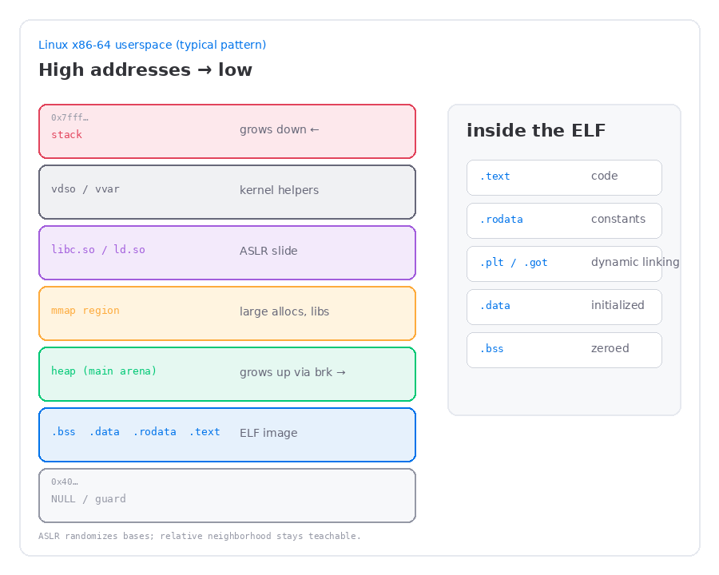
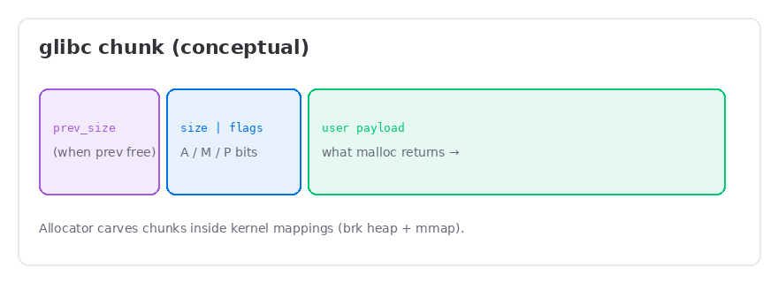

<aside class="callout callout-info">
<strong>Series</strong>
Part 1 of my heap notes. I'm deliberately stopping before freelists, tcache, and fastbin tricks — those are Part 2. This page is just the mental model I needed first.
</aside>

I used to treat “the heap” like a magical bag `malloc` pulled memory out of. Useful. Opaque. Definitely not something I could draw.

Then I tried reading a heap writeup that jumped straight into bins, and none of it stuck. What finally helped was stepping back: where does the **binary** live? the **stack**? libc? And where, physically in that map, is the thing people keep overflowing?

This is what I was able to figure out. Foundations only. No exploit recipes yet.

## The map that finally clicked

On a typical Linux **x86-64** process, the numbers jump around because of ASLR. The *neighborhood* doesn’t. Once I stopped memorizing hex and started remembering relatives, the picture got simple:

```text
HIGH  0x7fffffffffff ─────────────────────────────────
      │  stack                    grows ↓
      │  vdso / vvar              kernel↔user helpers
      │  libc.so, ld-linux…       shared objects (mmap)
      │  anonymous mmap           large malloc, thread stacks…
      │  ─── often a gap ───
      │  heap (main arena)        grows ↑ via program break
      │  ELF image                .text .rodata .data .bss
LOW   0x000000000000 ─────────────────────────────────
```



Three habits that stuck for me:

1. **Stack grows down** — every new frame eats lower addresses.
2. **Classic heap grows up** — by moving the **program break** past `.bss`.
3. **A lot of “heap” isn’t on that break** — big allocations and libraries show up as their own `mmap` regions.

<aside class="callout callout-tip">
<strong>ASLR, in practice</strong>
Yes, the bases slide. I still draw the same cartoon. Stack near the top, ELF toward the bottom of what the process uses, heap above the binary, libraries in the mmap belt. The slide is noise; the neighborhood is the lesson.
</aside>

## What’s actually inside “the binary”

I kept mixing up sections and segments. What mattered for intuition was the names I’d see in `readelf` / objdump and what job each one had:

| Region | What I use it for mentally |
| --- | --- |
| **`.text`** | Code. Usually r-x. |
| **`.rodata`** | Strings, `const` stuff. Read-only. |
| **`.data`** | Initialized globals. Writable. |
| **`.bss`** | Zeroed globals. Writable — and this is the edge the classic heap grows from. |
| **`.plt`** | Stubs for calls into shared libs (`puts@plt` and friends). |
| **`.got` / `.got.plt`** | Where those stubs eventually find real addresses (lazy binding on first call is the usual story). |

How I picture it now:

```text
  ┌────────────── ELF mapping ──────────────┐
  │  .text     code                         │
  │  .rodata   constants                    │
  │  .plt      “call puts@plt” stubs        │
  │  .got.plt  resolved libc pointers       │
  │  .data     initialized globals          │
  │  .bss      zeroed globals               │
  └──────────────────┬──────────────────────┘
                     │  program break starts near here
                     ▼
                 classic heap
```

`.plt` / `.got` confused me for a while because people mention them in exploit writeups. They’re **not** the heap. They’re how the binary talks to libc without baking absolute addresses at link time. They live with the process image. Writing a GOT entry is a late-game idea — for Part 1 I only needed: *dynamic linking has tables in the binary’s neighborhood; the heap is a different region.*

## When I finally opened `/proc/self/maps`

This was the moment it stopped being abstract. Tiny C program, `cat /proc/self/maps`, stare. Addresses below are made up; the **order** is what I kept:

```text
00400000-00401000  r-xp  …  /tmp/demo          .text
00600000-00601000  rw-p  …  /tmp/demo          .data / .bss
0192c000-0194d000  rw-p  …  [heap]             ← brk heap
7f2a8c000000-…     r-xp  …  libc.so.6
7f2a8c1eb000-…     rw-p  …  libc.so.6          libc data
7f2a8c400000-…     rw-p  …                     anonymous mmap
7ffc1a3d0000-…     rw-p  …  [stack]
7ffc1a4e6000-…     r-xp  …  [vdso]
```

What I look for now:

- **`[heap]`** — the main break region, sitting above the binary’s writable data.
- **libc / ld** — usually way up in the shared-library / mmap band.
- **`[stack]`** — near the top of userspace.
- Extra **anonymous `rw-p`** lines — large `malloc`s, thread stuff, etc. Still “heap” in my head as a programmer. Not always labeled `[heap]` by the kernel.

That last bullet was a real “oh.” I’d been saying “the heap” like it was one rectangle. `/proc` quietly disagreed.

## Why the heap has to exist

Stack memory is great until it isn’t. Locals show up when a function runs and disappear when it returns. Perfect for small, short-lived stuff. Useless when something needs to **outlive** the function, grow, or just be *big*.

I reach for the heap when:

- the object has to live past the return
- I don’t know the size at compile time (or it grows)
- I’d blow the stack with a huge local
- different objects need different lifetimes — free A, keep B

```c
/* The bug I had to unlearn: returning a local. */
char *bad_token(void) {
    char buf[64];
    fgets(buf, sizeof buf, stdin);
    return buf;           /* dangling — dies with the frame */
}

/* What I do instead: ask the heap, free later. */
char *good_token(void) {
    char *buf = malloc(64);
    if (!buf) return NULL;
    if (!fgets(buf, 64, stdin)) { free(buf); return NULL; }
    return buf;           /* lives until free(buf) */
}
```

Vectors, hash tables, AST nodes, packet buffers — same deal. Allocate now, free later, maybe `realloc` in the middle. That contract is also why heap bugs get interesting: the allocator trusts you about lifetime and size. Metadata sitting next to your buffer is part of that trust.

<aside class="callout callout-warn">
<strong>The one-liner that stuck</strong>
Stack lifetime follows control flow. Heap lifetime follows <code>malloc</code>/<code>free</code> (or <code>new</code>/<code>delete</code>) — plus whatever bookkeeping the allocator hid beside your bytes.
</aside>

## What’s under `malloc` (kernel side)

Userspace doesn’t invent pages. That was the other myth I had to drop. The C library asks the kernel for **mappings**, then carves those mappings into pieces you can hand around.

### `brk` / `sbrk` — the program break

The **program break** is “end of the data segment.” Nudge it up and you get more anonymous memory after `.bss`. That region is the classic `[heap]` line.

```text
  .text .data .bss |######## heap ########|  break
                   ^                      ^
                   start                  current break

  brk(new_addr)  → move the break
  sbrk(delta)    → nudge it by delta (wrapper around brk)
```

Smaller allocations historically grow this. Free doesn’t usually give the pages straight back — the allocator keeps the mapping and reuses chunks. That surprised me the first time I expected `free` to shrink `/proc`.

### `mmap` / `munmap` — whole new regions

`mmap` creates a **separate** virtual region. glibc leans on it for:

- **large** allocations (past a size threshold — “mmap chunks”)
- extra **arenas** / thread heaps
- loading **shared libraries** (the everyday case)

`munmap` tears a region down. Big mmap’d chunks can go back to the kernel more eagerly than break memory.

```text
  kernel view                          allocator view
  ────────────                         ──────────────
  [heap] via brk     ─────────────►    many chunks + free lists
  anon mmap #1       ─────────────►    one large chunk (or arena)
  anon mmap #2       ─────────────►    another large chunk
  libc.so mapping    ─────────────►    not “your” malloc heap
```

So when someone says “the heap,” I now hear: main break heap **plus** mmap’d large chunks **plus** maybe more arenas. Only the break region gets the `[heap]` sticker.

## What glibc does with those pages (just enough)

I call `malloc` / `free`. glibc’s **ptmalloc** (and friends) sits in the middle. I don’t need the whole freelist zoo yet — just vocabulary so Part 2 has somewhere to land:

| Idea | What it meant once it clicked |
| --- | --- |
| **Arena** | An allocator context (main arena on the break; others often mmap’d). |
| **Chunk** | Metadata header + payload. Your pointer points into the payload. |
| **In-use vs free** | Free chunks hang out in bins/caches; the metadata is still right there in the mapping. |
| **Carving** | Kernel gave a big `rw` region; the allocator subdivides it. |



```text
  malloc(n)
      │
      ├─ reuse a free chunk from a cache/bin?  ──► return payload
      ├─ carve from the top chunk / wilderness?
      └─ ask kernel: brk↑  or  mmap(anonymous)
```

Two layers I keep separate on purpose:

1. **Kernel** — pages exist, with permissions (`brk` / `mmap`).
2. **Allocator** — those pages are sliced into chunks with sizes and free-list links.

Exploit intuition starts when those layers disagree with the story your C code told — especially when **metadata next to your buffer** gets trusted on the next `malloc`/`free`.

## Why I care (light teaser only)

I don’t need freelist diagrams yet. I just needed to see the pressure points:

- **Overflow into the next chunk** — walk past your payload into a neighbor’s size/fields.
- **Use-after-free** — keep a dangling pointer; the chunk gets reused; suddenly you’re looking at someone else’s object (or freelist linkage).
- **Wrong lifetime / double free** — the allocator assumes a clean in-use ↔ free dance; break the dance and later calls walk garbage.

```text
  [ chunk A payload | A's meta | chunk B payload | … ]
         │                ▲
         └─ overflow ─────┘   ← adjacent metadata is uncomfortably close
```

Part 2 is where I’ll open the bins — tcache, fastbins, unsorted/small/large, consolidation, the first real primitives. Not today. I wanted the map first.

## What I can sketch cold now

After doing this the slow way, I can (finally) draw from memory:

1. High→low: stack, libs/mmap, heap, ELF — and which way stack/heap grow.
2. Why `.plt`/`.got` exist, and that they are **not** the heap.
3. Why programs need a heap (lifetime + size).
4. That `malloc` is userspace policy on top of `brk`/`mmap`.
5. That “heap” ≠ one `/proc` line — break heap plus mmap’d pieces.

<aside class="callout callout-tip">
<strong>Next</strong>
Part 2 — <a href="post.html?slug=someone-elses-chunk">Someone Else's Chunk</a>: use-after-free, overlapping views, and the House of Spirit <em>idea</em> — still no recipes. I needed this map before any of that made sense.
</aside>
